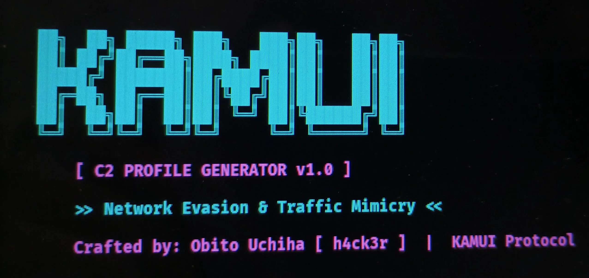

<p align="center">
  
</p>

# 🟣 Malleable-C2-Profiles
### *KAMUI — Network Evasion & Traffic Mimicry Engine*

[](https://www.python.org/downloads/)
[](https://opensource.org/licenses/MIT)
[](https://havocframework.com/)

---

## 👥 Who Can Use This Tool?

| Role | How They Use It |
| :--- | :--- |
| **🔴 Red Team Operators** | Generate custom C2 profiles that evade network-level EDRs and firewalls. |
| **🟣 Purple Teamers** | Test detection rules against realistic, evasive C2 traffic. |
| **🛡️ SOC Analysts** | Understand how attackers mimic legitimate traffic to bypass defenses. |
| **🎓 Security Students** | Learn advanced adversary tradecraft and C2 infrastructure. |

> **⚠️ DISCLAIMER:** This tool is for **educational purposes and AUTHORIZED security testing ONLY**. The author is not responsible for any misuse. Use only on systems you own or have explicit written permission to test.

---

## 🎯 Features

- ✅ **Traffic Mimicry**: Generates profiles that mimic Google, Microsoft, or AWS traffic patterns.
- ✅ **Customizable Domains**: Add your own legitimate domains to impersonate.
- ✅ **Realistic User-Agents**: Uses up-to-date browser strings to avoid detection.
- ✅ **TLS Configuration**: Includes modern TLS versions and ciphers (TLSv1.2, TLSv1.3).
- ✅ **YAML Output**: Standard format compatible with Havoc C2 and Cobalt Strike.
- ✅ **KAMUI Branding**: Professional Cyber Cyan banner on every run—HR approved.
- ✅ **Zero Dependencies**: Only requires `pyyaml` and `colorama`.

---

## 📦 Installation (On Kali / Attacker Machine)

Open your terminal and run these **exact commands**:

```bash
git clone https://github.com/cossackrider8-glitch/Malleable-C2-Profiles.git
cd Malleable-C2-Profiles
python3 -m venv venv
source venv/bin/activate
pip install -r requirements.txt
(Wait for all packages to install).

🔑 Configuration (Choose Your Mimicry)
Step 1: Open the config file
bash
nano config.py
Step 2: Choose your mimic type
Find this line:

python
MIMIC_TYPE = "google"   # Options: google, microsoft, aws
Mimic Type	What It Mimics
google	Google Search traffic (URIs, headers, TLS)
microsoft	Office 365 / Azure AD traffic
aws	AWS API calls (S3, EC2, etc.)
Step 3: (Optional) Add your own domains
python
DOMAINS = [
    "www.google.com",
    "www.microsoft.com",
    "your-domain.com"   # ADD YOUR OWN
]
Step 4: Save the file
CTRL + X, then Y, then Enter.

🚀 Usage (How to Run)
bash
python3 generator.py
What happens next:
The CYAN KAMUI banner prints.

A random domain and user-agent are selected.

A custom YAML C2 profile is generated.

The profile is saved in the profiles/ folder.

Example Output:
text
[+] Generating KAMUI C2 Profile...
[+] Mimic Type: GOOGLE
[+] Domain: www.google.com
[+] User-Agent: Mozilla/5.0 (Windows NT 10.0; Win64; x64) AppleWebKit/537.36...
[+] Profile saved to: profiles/KAMUI_GOOGLE_1712345678.yaml
📂 Generated Profile Example
yaml
name: KAMUI_GOOGLE_Profile
description: Mimics Google traffic for C2 evasion
author: Obito Uchiha
created: 2026-07-21T22:46:10.123456
http:
  domain: www.google.com
  uris:
    - /search?q=
    - /_/chrome/newtab?
    - /complete/search?
  headers:
    Accept: text/html,application/xhtml+xml,application/xml;q=0.9,*/*;q=0.8
    Accept-Language: en-US,en;q=0.5
    Sec-Fetch-Dest: document
    Sec-Fetch-Mode: navigate
  user_agent: Mozilla/5.0 (Windows NT 10.0; Win64; x64) AppleWebKit/537.36 Chrome/126.0.0.0
  ssl:
    versions:
      - TLSv1.2
      - TLSv1.3
    ciphers:
      - TLS_AES_128_GCM_SHA256
      - TLS_AES_256_GCM_SHA384
🔄 How to Switch Mimic Types
Open config.py and change:

python
MIMIC_TYPE = "aws"   # Switch to AWS mimicry
Save and run python3 generator.py again.

❓ TROUBLESHOOTING
Problem	Solution
ModuleNotFoundError: No module named 'colorama'	Run pip install -r requirements.txt inside the venv.
ModuleNotFoundError: No module named 'yaml'	Run pip install pyyaml inside the venv.
Profile not saving	Make sure the profiles/ folder exists.
Virtual environment not activating	Run source venv/bin/activate
🗺️ MITRE ATT&CK Mapping (Industry Standard)
Tactic	Technique ID	Technique Name
Command and Control	T1071.001	Web Protocols (HTTP/HTTPS)
Defense Evasion	T1027.009	Obfuscated Files or Information (Embedded C2)
Defense Evasion	T1573.001	Encrypted Channel (TLS)
Defense Evasion	T1090	Proxy (Domain Fronting)
📂 Repository Structure
text
Malleable-C2-Profiles/
├── generator.py          # Main engine (KAMUI Banner + Profile Builder)
├── config.py             # Mimic type, domains, user-agents
├── requirements.txt      # Python dependencies (pyyaml, colorama)
├── profiles/             # Generated YAML profiles
│   └── KAMUI_GOOGLE_*.yaml
├── kamui-banner.webp     # Cyber Cyan Banner Image
└── README.md             # This complete manual
⚠️ Final Warning
This tool is for authorized security testing and educational purposes only.
Unauthorized use of C2 profiles to evade detection is illegal. The creator assumes zero liability for misuse. By using this tool, you agree to use it ethically and legally.

🤝 Contributing
Found a bug or want to add new mimic types (e.g., Facebook, Netflix, Zoom)?
Open an issue or submit a Pull Request.

📜 License
MIT License - Free to use, modify, and distribute.

Star ⭐ this repo if you found it useful! It helps other cybersecurity professionals find it. 🚀
MIT License - Free to use, modify, and distribute.

Star ⭐ this repo if you found it useful! It helps other cybersecurity professionals find it. 🚀
